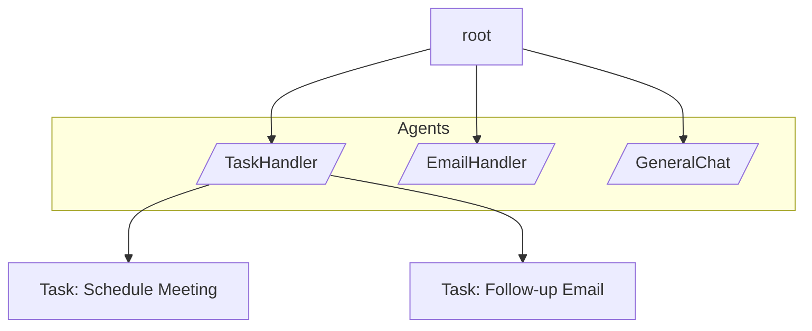

# Building Agentic AI Applications with byLLM

Agentic AI applications represent the next evolution in software systems. This guide explains how such applications can be built using the **Jaseci Stack**, with a focus on the **byLLM** plugin.

Before diving into the development process, it’s important to understand what Agentic AI is and what building such systems entails.

An **AI agent** is a software entity capable of autonomously performing actions using available resources to achieve defined goals.  
In traditional systems, all tools and actions are explicitly defined by humans.

**Agentic AI**, in contrast, refers to AI systems that can **independently plan, decide, and act** toward a goal using available tools and contextual information—**without** relying on a fixed, human-defined sequence of steps.

An agentic application can be visualized as a **graph or network**, where:
- **Each node** represents an **agent**.
- An **orchestrator** traverses this graph, managing how agents collaborate to achieve a shared goal.

To build such applications, we need to:
1. Represent agents as nodes in a graph.  
2. Implement an **orchestrator agent** responsible for graph traversal and coordination.  
3. Integrate **LLMs** to guide traversal logic and decision-making.

> These capabilities are natively supported through **Object Spatial Programming (OSP)** in **Jaclang**, combined with **byLLM** for AI integration.

## Example: TaskManager

As an example epplication that demonstrate these capabilites we picked a agentic task manager application build in Jac. In this usecase we have 3 main agents, a Task Handler, an Email Handler and a General chat agent. 



### Object Spatial Programming for Agentic AI

Lets now understand the three main constructs in OSP and identify how it is related to Agentic workflows

1. **Nodes**: Nodes correspond to where compute and logic may run. Nodes can have attributes (for data) and special method function which cannot be called but can be triggered by a preset event. 
2. **Edges**: Edges make explicit conections between nodes. This allow agentic workflows to be explicitly defined.
3. **Walkers**: An entity that can be spawned on the graph and they traverser the graph serving as the triggering entity of node methods defined on node classes.

## Defining Agents as nodes 

Below is a short walkthrough of how the TaskManager example is implemented (see the example source at `jac-byllm/examples/agentic_ai/task-manager-lite/task_manager.jac`). The goal is to map the Jac constructs to the Agentic AI architecture described above.


**Task node** (`node Task`) is a simple data object used to store individual tasks. New `Task` nodes are created when `TaskHandling.add_task` is called and are linked back to the handler using `self ++> task_created;` so the handler keeps local knowledge of scheduled tasks.

```jac linenums="1"
node Task {
  has task:str = "";
  has date:str = "";
  has time:str = "";
}
```

**TaskHandling** node (`node TaskHandling`) 

Implements tools callable by LLM for TaskHandling as Member methods of the node:

- `get_current_time()` — utility returning a formatted timestamp
- `add_task(task, date, time)` — creates a `Task` node and links it to the handler
- `summarize_tasks` — queries linked task nodes and returns a string summary

Now the **byLLM** annotated AI-Integrated function

- `route_and_run(utterance)` — annotated `by llm(method="ReAct", tools=(...))`, it uses the LLM (and the ReAct pattern) together with tool handles (local methods like `add_task`, `get_current_time`, `summarize_tasks`) to plan and act. The `tools` array gives the LLM access to deterministic tools it can call when planning or executing.

The main logic of the agent is implemented in the `can execute with task_manager entry` ability of the node which gets triggered when the `task_manager` visits the `TaskHandling` node.

```jac linenums="1"
node TaskHandling {
  def get_current_time() -> str {
    return time.strftime("%Y-%m-%d %H:%M:%S", time.gmtime());
  }

  def add_task(task: str, date: str, time: str) -> str {
    task_created = Task(task=task, date=date, time=time);
    self ++> task_created;
    return "Task added successfully";
  }

  def summarize_tasks -> str {
    scheduled_tasks = [self-->(`?Task)];
    return str(scheduled_tasks);
  }

  def route_and_run(utterance: str) -> str by llm(
    method="ReAct",
    tools=([self.add_task, self.get_current_time, self.summarize_tasks])
  );

  can execute with task_manager entry {
    print("[TaskHandling Node Activated]");
    response = self.route_and_run(visitor.cur_task.task);
    print("→", response);
    report {
      "utterance": visitor.cur_task.task,
      "response": response,
      "node_type": self.__class__.__name__
    };
  }
}
```

In a similar fashion we can implement the other two agents.

**EmailHandling** node (`node EmailHandling`) — exposes `write_email_content` and `route_and_run` which call the LLM to compose and manage emails.

```jac linenums="1"
node EmailHandling {
  def write_email_content(utterance: str) -> str by llm();
  def route_and_run(utterance: str) -> str by llm(
    method="ReAct",
    tools=([self.write_email_content])
  );
  can execute with task_manager entry {
    print("[EmailHandling Node Activated]");
    response = self.route_and_run(visitor.cur_task.task);
    print("→", response);
    report {
      "utterance": visitor.cur_task.task,
      "response": response,
      "node_type": self.__class__.__name__
    };
  }
}
```

**GeneralChat** node (`node GeneralChat`) — provides a `chat` method backed by `by llm()` for general conversational assistance.

```jac linenums="1"
node GeneralChat {
  def chat(utterance: str) -> str by llm();
  can execute with task_manager entry {
    print("[GeneralChat Node Activated]");
    response = self.chat(visitor.cur_task.task);
    print("→", response);
    report {
      "utterance": visitor.cur_task.task,
      "response": response,
      "node_type": self.__class__.__name__
    };
  }
}
```

<!-- - Routing types and partitioning — the example defines an `enum RoutingNodes` and an `obj TaskPartition { has task: str; has agent_type: RoutingNodes; }` which let the orchestrator represent subtasks with their intended agent type (Task/Email/Chat). -->

### Defining Orchestrator as the walker

The `walker task_manager` is the orchestrator. It receives the top-level `utterance` (the user's high-level task), then delegates planning and routing to the LLM:

The `plan_tasks(main_task: str) -> list[TaskPartition] by llm()` asks the LLM to decompose the main task into a list of subtasks object instances of following structure. To represent the specific agent we define a representative `Enum` `RoutingNodes`. The code for the declaration of these constructs are as follows.


```jac linenums="1"
enum RoutingNodes{
  TASK_HANDLING,
  EMAIL_HANDLING,
  GENERAL_CHAT
}

obj TaskPartition {
  has task: str;
  has agent_type: RoutingNodes;
}
```


The walker then iterates through the returned subtasks, maps the `agent_type` to the corresponding node class (`TaskHandling`, `EmailHandling`, `GeneralChat`), ensures a node instance exists, sets `self.cur_task = subtask`, and `visit`s the routed node so the node's `can execute with task_manager entry` code runs.

```jac linenums="1"
walker task_manager {
  has utterance: str = "";
  has cur_task: TaskPartition = None;

  def route_to_node(utterance: str) -> RoutingNodes by llm();

    
  def plan_tasks(main_task: str) -> list[TaskPartition] by llm();

  can execute with `root entry {
    # routed_node_name = self.route_to_node(self.utterance);
    subtasks = self.plan_tasks(self.utterance);

    print("[Planned Subtasks]:", subtasks);
    
    node_map = {
      RoutingNodes.TASK_HANDLING: TaskHandling,
      RoutingNodes.EMAIL_HANDLING: EmailHandling,
      RoutingNodes.GENERAL_CHAT: GeneralChat
    };
    for subtask in subtasks {
      node_type = node_map[subtask.agent_type];
      routed_node = [-->(`?node_type)];
      if not routed_node {
        routed_node = here ++> node_type();
      }
      self.cur_task = subtask;
      visit routed_node;
    }
  }
}
```

## LLM usage and the ReAct pattern

The example uses `by llm(method="ReAct", tools=(...))` for methods that need both reasoning and tool calls. ReAct is convenient here because:

- It allows the LLM to interleave reasoning and actions (e.g., call `add_task`, then call `get_current_time`, then produce a final answer).
- The `tools` list exposes safe, deterministic functions the LLM can call to change graph state or fetch structured data.

Because the example wires those tool entry points to Jac node methods, every tool call happens inside the Jac runtime and updates the object graph (nodes/edges) in a reproducible way.

## Usage of Semstrings for extra context

In some cases the LLM may need more context about the developer's intent. Especially in places like routing providing addition context can be benefitial fir performance. Following code excerpts show some semstrings used to annotate the Enum that act as proxies for the actual agents.

```jac linenums="1"
sem RoutingNodes.TASK_HANDLING = "Creating/deleting/updating/summarizing tasks to TODO";
sem RoutingNodes.EMAIL_HANDLING = "EmailHandling node for composing and managing emails";
sem RoutingNodes.GENERAL_CHAT = "Get intelligent answers, productivity advice, and general AI assistance across various topics.";
```